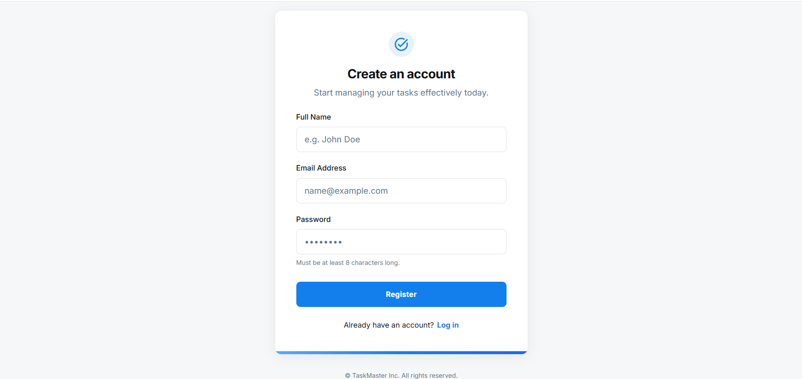
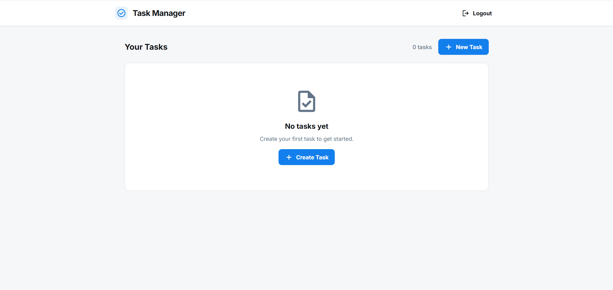

# Task Manager Application

A modern, full-stack task management application with user authentication, pagination, and cloud deployment.

## 🌐 Live Demo

**Frontend:** [https://task-manager-frontend-ec90kpztu-amyasserfs-projects.vercel.app](https://task-manager-frontend-ec90kpztu-amyasserfs-projects.vercel.app)

**Backend API:** [https://task-manager-production-7c7a.up.railway.app](https://task-manager-production-7c7a.up.railway.app/health)

**Deployment:**
- Frontend: Vercel
- Backend: Railway
- Database: SQLite (persistent storage)


## 📋 Table of Contents

- [Features](#features)
- [Tech Stack](#tech-stack)
- [Project Structure](#project-structure)
- [Prerequisites](#prerequisites)
- [Installation](#installation)
- [Running the Application](#running-the-application)
- [API Documentation](#api-documentation)
- [Testing](#testing)
- [Docker Deployment](#docker-deployment)
- [Production Deployment](#production-deployment)
- [Assumptions](#assumptions)

## ✨ Features

- 🔐 **User Authentication** - Secure registration and login with JWT
- ✅ **Task Management** - Create, read, update, and delete tasks
- 📄 **Pagination** - Efficient task browsing with paginated results
- 🎨 **Modern UI** - Clean, responsive design with dark mode support
- 🐳 **Docker Ready** - Containerized deployment with Docker Compose
- 🔒 **Secure** - Password hashing with bcrypt, JWT authentication
- 📱 **Responsive** - Works seamlessly on desktop and mobile devices

## 🛠 Tech Stack

### Frontend
- **React** - UI library
- **React Router** - Client-side routing
- **Axios** - HTTP client
- **Tailwind CSS** - Utility-first CSS framework
- **Material Symbols** - Icon library

### Backend
- **Node.js** - Runtime environment
- **Express** - Web framework
- **SQLite** - Database (via better-sqlite3)
- **JWT** - Authentication
- **bcryptjs** - Password hashing

## 📁 Project Structure

```
task-manager/
├── backend/                 # Backend API
│   ├── src/
│   │   ├── config/         # Database configuration
│   │   ├── controllers/    # Route controllers
│   │   ├── middleware/     # Auth middleware
│   │   ├── models/         # Data models
│   │   ├── routes/         # API routes
│   │   └── index.js        # Entry point
│   ├── tests/              # Backend tests
│   ├── Dockerfile          # Backend container
│   └── package.json
│
├── frontend/               # Frontend React app
│   ├── public/            # Static assets
│   ├── src/
│   │   ├── api/           # API configuration
│   │   ├── components/    # Reusable components
│   │   ├── context/       # React context
│   │   ├── pages/         # Page components
│   │   └── main.jsx       # Entry point
│   ├── Dockerfile         # Frontend container
│   ├── nginx.conf         # Nginx configuration
│   └── package.json
│
├── docker-compose.yml     # Docker orchestration
├── DOCKER.md             # Docker documentation
└── README.md             # This file
```

## 📋 Prerequisites

- **Node.js** 18+ and npm
- **Docker** and Docker Compose (for containerized deployment)

## 🚀 Installation

### Option 1: Local Development

#### Backend Setup

```bash
cd backend
npm install
```

Create a `.env` file in the backend directory:

```env
PORT=5000
JWT_SECRET=your-secret-key-here-change-in-production
JWT_EXPIRES_IN=24h
```

#### Frontend Setup

```bash
cd frontend
npm install
```

### Option 2: Docker (Recommended)

No installation needed! Just have Docker installed.

## 🏃 Running the Application

### Local Development

#### Start Backend
```bash
cd backend
npm start
# Or for development with auto-reload:
npm run dev
```

Backend will run on `http://localhost:5000`

#### Start Frontend
```bash
cd frontend
npm run dev
```

Frontend will run on `http://localhost:5173`

### Docker Deployment

```bash
# From the project root
docker-compose up --build
```

- Frontend: `http://localhost`
- Backend: `http://localhost:5000`

To stop:
```bash
docker-compose down
```

## 📚 API Documentation

### Base URL
```
http://localhost:5000
```

### Authentication Endpoints

#### Register User
```http
POST /auth/register
Content-Type: application/json

{
  "name": "John Doe",
  "email": "john@example.com",
  "password": "password123"
}
```

**Response:**
```json
{
  "message": "User registered successfully",
  "token": "jwt-token-here",
  "user": {
    "id": 1,
    "name": "John Doe",
    "email": "john@example.com"
  }
}
```

#### Login
```http
POST /auth/login
Content-Type: application/json

{
  "email": "john@example.com",
  "password": "password123"
}
```

**Response:**
```json
{
  "message": "Login successful",
  "token": "jwt-token-here",
  "user": {
    "id": 1,
    "name": "John Doe",
    "email": "john@example.com"
  }
}
```

### Task Endpoints

All task endpoints require authentication. Include the JWT token in the Authorization header:
```
Authorization: Bearer <your-jwt-token>
```

#### Get All Tasks (Paginated)
```http
GET /tasks?page=1&limit=10
```

**Response:**
```json
{
  "tasks": [
    {
      "id": 1,
      "title": "Complete project",
      "description": "Finish the task manager app",
      "status": "in_progress",
      "created_at": "2024-01-15T10:30:00.000Z",
      "user_id": 1
    }
  ],
  "pagination": {
    "page": 1,
    "limit": 10,
    "total": 25,
    "totalPages": 3,
    "hasMore": true
  }
}
```

#### Create Task
```http
POST /tasks
Content-Type: application/json

{
  "title": "New Task",
  "description": "Task description",
  "status": "pending"
}
```

**Response:**
```json
{
  "id": 2,
  "title": "New Task",
  "description": "Task description",
  "status": "pending",
  "created_at": "2024-01-15T11:00:00.000Z",
  "user_id": 1
}
```

#### Update Task
```http
PUT /tasks/:id
Content-Type: application/json

{
  "title": "Updated Title",
  "description": "Updated description",
  "status": "done"
}
```

#### Delete Task
```http
DELETE /tasks/:id
```

**Response:**
```json
{
  "message": "Task deleted successfully"
}
```

### Status Values
- `pending` - Task not started
- `in_progress` - Task in progress
- `done` - Task completed

## 🧪 Testing

### Backend Tests

```bash
cd backend
npm install  # Install dependencies including jest and supertest
npm test     # Run tests with coverage
npm run test:watch  # Run tests in watch mode
```

Tests cover:
- ✅ User registration and validation
- ✅ User login and authentication
- ✅ Task CRUD operations
- ✅ Authorization checks
- ✅ Pagination functionality

## 🐳 Docker Deployment

**Quick Start:**
```bash
docker-compose up --build
```

## 🚀 Production Deployment

This application is deployed on:

**Frontend (Vercel):**
- URL: https://task-manager-frontend-ec90kpztu-amyasserfs-projects.vercel.app
- Automatic deployments from GitHub
- Global CDN distribution

**Backend (Railway):**
- URL: https://task-manager-production-7c7a.up.railway.app
- Automatic deployments from GitHub
- Persistent SQLite database storage

**To deploy your own version:**
1. **Backend:** Push to GitHub → Deploy on [Railway.app](https://railway.app)
2. **Frontend:** Push to GitHub → Deploy on [Vercel.com](https://vercel.com)
3. Set environment variables (see [DEPLOYMENT.md](./DEPLOYMENT.md) for details)


## 📝 Assumptions

### Authentication
- JWT tokens expire after 24 hours (configurable)
- Passwords must be at least 8 characters
- Email addresses must be unique
- Tokens are stored in localStorage on the client

### Database
- Using SQLite for simplicity (file-based database)
- Database file created automatically on first run
- No migrations needed for initial setup
- Data persists in `backend/tasks.db`

### Pagination
- Default page size: 10 tasks
- Page numbers start at 1
- Returns empty array if page exceeds total pages

### Task Management
- Tasks are user-specific (users can only see their own tasks)
- Task status can be: `pending`, `in_progress`, or `done`
- Tasks are sorted by creation date (newest first)
- Deleting a user does not cascade to tasks (not implemented)

### Frontend
- Designed for modern browsers (Chrome, Firefox, Safari, Edge)
- Requires JavaScript enabled
- Uses localStorage for token persistence
- Responsive design works on screens 320px and above

### Security
- CORS enabled for development (configure for production)
- JWT secret should be changed in production
- HTTPS recommended for production deployment
- No rate limiting implemented (add for production)

### Error Handling
- 401 errors redirect to login (except on login/register pages)
- Network errors show user-friendly messages
- Form validation on both client and server
- Invalid tokens are automatically cleared

## 📸 Screenshots

### Login Page


### Dashboard


### Task Management



## 🤝 Contributing

1. Fork the repository
2. Create a feature branch
3. Make your changes
4. Run tests
5. Submit a pull request

## 📄 License

MIT License - feel free to use this project for learning or production.

## 🙏 Acknowledgments

- Built with React and Express
- Icons from Material Symbols
- Styled with Tailwind CSS
